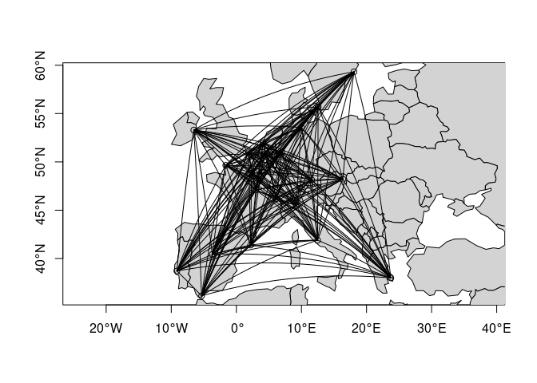

[](https://cran.r-project.org/package=geonetwork)
[](https://cirad-astre.r-universe.dev/)

<!-- README.md is generated from README.Rmd. Please edit that file -->

# geonetwork

Classes and methods for handling networks or graphs whose nodes are
geographical (i.e. locations in the globe). Create, transform, plot.

## Installation

You can install the released version of `geonetwork` from
[CRAN](https://CRAN.R-project.org) with:

``` r
install.packages("geonetwork")
```

Alternatively, install the latest development version with:

``` r
install.packages("geonetwork", repos = 'https://cirad-astre.r-universe.dev')
```

## Example

### Creation

A `geonetwork` is an object of class `igraph` whose nodes have
*geospatial* attributes (i.e. coordinates and CRS).

Consider the distances (in km) between 21 cities in Europe from the
`datasets` package. A simple way of constructing a `geonetwork` is by
combining a data.frame of `nodes` with one of `edges`:

``` r
## Use OpenStreetMap's Nominatim service through the package {tmaptools}
## to retrieve coordinates of the cities.
## Restrict search to Europe (to prevent homonym cities to show up)
cities <- tmaptools::geocode_OSM(
  paste(
    labels(datasets::eurodist),
    "viewbox=-31.64063%2C60.93043%2C93.16406%2C31.65338",
    sep = "&"
  )
)
cities$city <- labels(datasets::eurodist)

distances <- 
  expand.grid(
    origin = labels(datasets::eurodist),
    destin = labels(datasets::eurodist),
    stringsAsFactors = FALSE,
    KEEP.OUT.ATTRS = FALSE
  )
distances <- 
  cbind(
    distances[distances$destin < distances$origin,],
    distance = as.numeric(datasets::eurodist)
  )

str(cities)
#> 'data.frame':    21 obs. of  8 variables:
#>  $ query  : chr  "Athens&viewbox=-31.64063%2C60.93043%2C93.16406%2C31.65338" "Barcelona&viewbox=-31.64063%2C60.93043%2C93.16406%2C31.65338" "Brussels&viewbox=-31.64063%2C60.93043%2C93.16406%2C31.65338" "Calais&viewbox=-31.64063%2C60.93043%2C93.16406%2C31.65338" ...
#>  $ lat    : num  38 41.4 50.8 51 49.5 ...
#>  $ lon    : num  23.73 2.18 4.35 1.85 -1.58 ...
#>  $ lat_min: num  37.8 41.3 50.7 50.9 49.3 ...
#>  $ lat_max: num  38.1 41.5 51 51 49.7 ...
#>  $ lon_min: num  23.57 2.05 4.19 1.81 -1.96 ...
#>  $ lon_max: num  23.89 2.23 4.51 1.93 -1.14 ...
#>  $ city   : chr  "Athens" "Barcelona" "Brussels" "Calais" ...
str(distances)
#> 'data.frame':    210 obs. of  3 variables:
#>  $ origin  : chr  "Barcelona" "Brussels" "Calais" "Cherbourg" ...
#>  $ destin  : chr  "Athens" "Athens" "Athens" "Athens" ...
#>  $ distance: num  3313 2963 3175 3339 2762 ...

eurodist <- geonetwork(
  distances,
  nodes = cities[, c("city", "lon", "lat")], 
  directed = FALSE
)
```

Several assumptions were made here unless otherwise specified:

-   The first column in `cities` was matched with the first two columns
    in `distances`.

-   The second and third columns in `cities` were assumed to be
    longitude and latitude in decimal degrees in a WGS84 CRS.

-   The remaining column in `distances` was treated as an edge *weight*.

Now we can readily plot the network, optionally with some additional
geographical layer for context:

``` r
## Base system
plot(eurodist, axes = TRUE, type = "n")
plot(sf::st_geometry(spData::world), col = "lightgray", add = TRUE)
plot(eurodist, axes = TRUE, add = TRUE)
```


